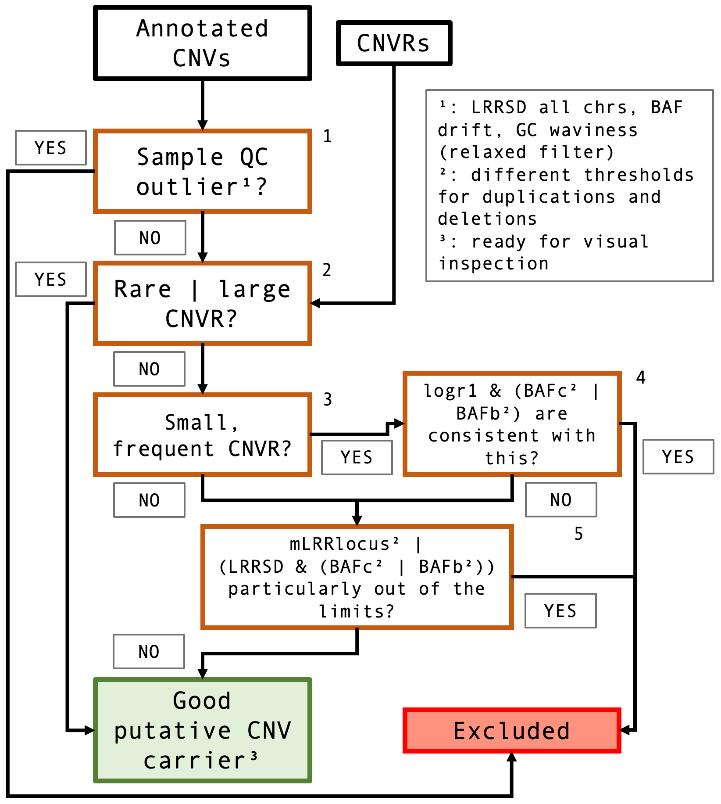

# QCtreeCNV

[](https://travis-ci.com/SinomeM/QCtreeCNV)

## Introduction

This is the development repository for the QC filter I am working
on in the context of reducing the human effort in CNV calling. Here
the focus is on calling recurrent CNVs in fixed loci in particular.

The aim is to integrate a much more powerful filter in the pipeline,
before visual inspection, as exemplified in this figure.


## The filtering pipeline

The filtering pipeline is implemented as a decision making tree, a series of
consecutive steps that separate good putative candidates form bad ones.
This scheme gives a good first peek at this process.



## Install

You can install the package via:

```
devtools::install_github("sinomem/QCtreeCNV")
```

## Details

See the package vignettes for more details. Assuming the package is installed
in your system you can do:

```
browseVignettes("QCtreeCNV")
```
