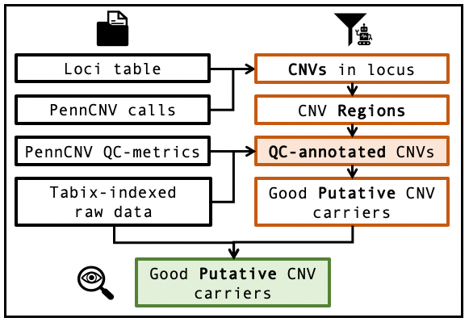

# QCtreeCNV

[](https://travis-ci.com/SinomeM/QCtreeCNV)

## Introduction

This R package implement a powerful CNV filtering pipeline as exemplified in the following figure.
It is part of a protocol with a companion repository, <https://github.com/SinomeM/IBPcnv>.

If you use thih software please cite <https://doi.org/10.1002/cpz1.621>



## The filtering pipeline

The filtering pipeline is implemented as a decision making tree, a series of
consecutive steps that separate good putative candidates form bad ones.
This scheme describe the process.


## Install

You can install the package via:

```
devtools::install_github("sinomem/QCtreeCNV")
```

## Details

See the package vignettes for more details. Assuming the package is installed
in your system you can do:

```
browseVignettes("QCtreeCNV")
```
