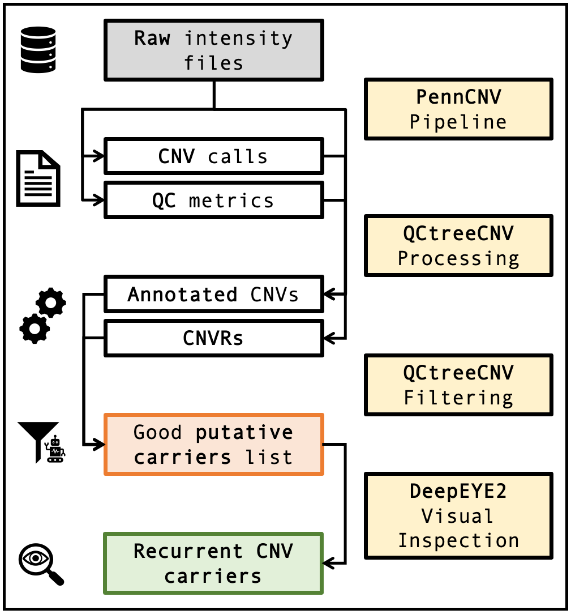

```{r, include = FALSE}
knitr::opts_chunk$set(
  collapse = TRUE,
  comment = "#>"
)
```


# Introduction

The aim of this package is to provide a powerful filtering pipeline
of CNV calling data in fixed loci, before the visual inspection. This
to reduce the amount of human effort as much as possible, discarding
putative calls that we can be sure are not TRUE using a set of quality
metrics derived from the raw data.

The focus is PennCNV calls, however it can in principle work with
any other software output, given the availability
of the three following global quality scores: BAF drift, LRR SD,
GC Waviness Factor.

Please note also that at the moment only Illumina SNP array data
and autosomal chromosomes (1:22) are supported.

This is a graphical representation of a CNV calling pipeline in fixed
genomic loci. The package implement a filtering step just before visual
inspection.

{width=100%}


# Setup

To install and load the latest version of the package you can
run the following code:

```{r setup, eval=F}
## NOT RUN ATM
devtools::install_github("SinomeM/QCtreeCNV")
library(QCtreeCNV)
```


# Data Format

The main function require three main input objects:

1. a `data.frame` (bonus if already `data.table`)
   containing the putative CNV carriers calls;   
1. a `data.frame` (bonus if already `data.table`)
   containing the required quality metrics, it can be
   created using provided functions;   
2. a `data.table` containing CNVRs info, this is computed
   by a package function starting from table 1.

We provide functions to create the quality metrics table
starting from:

a. the raw intensity files;   
b. genomic coordinates of the loci of interest;   
c. a table to link samples ID to the raw intensity files.

Se the section [Run the Pipeline](#run-the-pipeline) for graphical representation
of the package pipeline and functions.

Specifications on each object is given in the following sections.
We try to be consistent with
[CNVgears](https://bioconductor.org/packages/CNVgears/) format when
possible, and a further interconnection between the two packages is planned.

## Main objects

### CNV calls

Table 1 consist of the [...]

#### Format

| Column Name | Format   | Notes  |
| :---------- | :----:   | :----  |
| sample_ID   | \<chr\>  | _      |
| locus       | \<chr\>  | e.g. 22q11.2 |
| chr         | \<int\>  | 1:24   |
| start       | \<int\>  | _      |
| end         | \<int\>  | _      |
| GT          | \<int\>  | 0/1/2\*|
| CN          | \<int\>  | 0:5\*  |
| CNVR_ID     | \<chr\>  | this columns is added by the package |

\*Both measure are necessary. GT can be computed with a provided
function.

Details [...]

### Quality metrics / Raw data trends

Table 2 consist of [...]

#### Format

| Column Name  | Format    | Notes |
| :----------  | :----:    | :---- |
| sample_ID    | \<chr\>   | _     |
| locus        | \<chr\>   | _     |
| putCarrier  | \<logi\>  | is the sample a putative carrier for this locus?\* |
| logr1        | \<num\>   | \*\*     |
| LRRSDlocus   | \<num\>   | \*\*     |
| BAFc         | \<num\>   | \*\*     |
| BAFb         | \<num\>   | \*\*     |
| centDistProp | \<num\>   | \*\*     |
| overlapProp  | \<num\>   | \*\*     |
| BAFdrift     | \<num\>   | \*\*     |
| LRRSD        | \<num\>   | \*\*     |
| GCWF         | \<num\>   | \*\*     |

\*: Currently if the table is created using the provided functions
one line is created for each sample/locus combination, even if the
sample is a putative carrier only for one specific locus. Note
however that this is not mandatory, it is for done mostly to reuse
computation time in downstream efficacy measures.   
\*\*: details on each measure is given below.

Details [...]

### CNVRs

Table 3 consist of [...]

#### Format

| Column name | Format   | Notes |
|-------------| :------: |-------|
| CNVR_ID     | \<chr\>  | matches the one in table 1 |
| chr         | \<int\>  | 1:24  |
| start       | \<int\>  | _     |
| end         | \<int\>  | _     |
| freq        | \<int\>  | number of samples with a CNV in the region |

## Objects required to create the QC metrics table using the package

We provide functions to easily create the quality metrics table, see the
section [Run the Pipeline](#run-the-pipeline) for details.

### Sample list

This is required to link each sample to an intensity file, it
needs to have the following format:

| Column name | Format | Notes                                             |
|-------------|:------:|---------------------------------------------------|
| sample_ID   | <chr>  | as in table 1, 2 and 3                            |
| file_path   | <chr>  | full path (from `/` or `~`) to the intensity file |

### Loci coordinates

Genomic coordinates of the loci of interest, needed to extract only the
necessary markers from the intensity files. It needs to have the following
format:

| Column name | Format | Notes                                         |
|-------------| :----: |-----------------------------------------------|
| locus       | <chr>  | as in table 1 and 2                           |
| chr         | <chr>  | 1:24                                          |
| start       | <int>  | _                                             |
| end         | <int>  | _                                             |
| length      | <int>  | if not present will be computed automatically |

### Intensity files

We need LRR and BAF to compute the quality scores metrics,
at the moment only data from Illumina array is supported. Moreover
only "standard" Final Report format is supported at the moment, meaning
that the function will look for the following columns:

1. `Chr`   
1. `Position`   
1. `Log R Ratio`   
1. `B Allele Freq`   
1. `SNP Name`   

Both intensity file with full genomic coordinates (columns 1 and 2)
and with only `SNP Name` (column 5) are supported, however the `snppos`
file is required in the second situation. It should have been already
computed by PennCNV anyway.

Please note that the package expect one file for each sample.

# Run the Pipeline

The package has two main functions:

1. `computeCNVRs()` clusterize/collapse CNVs into CNV Regions;   
1. `qctree()` runs the filtering pipeline;

In principle one could also use a different method to create
CNVRs, as long as the output format is compatible to the `QCtreeCNV`
one.

We provide two additional functions to easily create the
quality metrics table, however it can be computed by the user
separately, as long as the resulting table follows the format requirements.
Moreover the package include functions to standardise `chr` and `GT` / `CN`
notation.

The two following images give a graphical representation of the package
standard pipeline (with the specific function used in each step) and of
the decision making tree implemented with `qctree()`.

{width=100%}

{width=80%}

## Details

Some details on each step, the numbering follows the one in the figure.

Fig 2:

1. df
2. dsf
3. sfd
4. sdf
5. df

Fig 3:

1. df
2. dsf
3. sfd
4. sdf
5. df
6. dfd

# Session

```{r}
sessionInfo()
```

